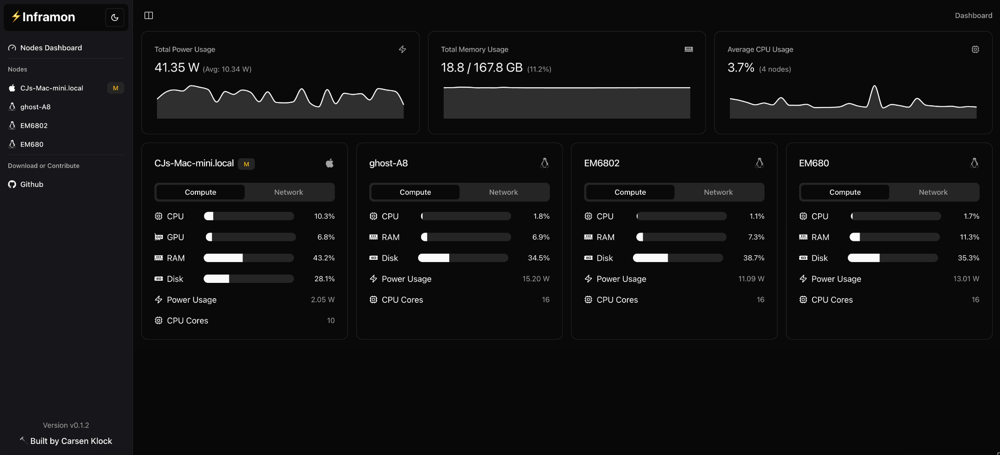
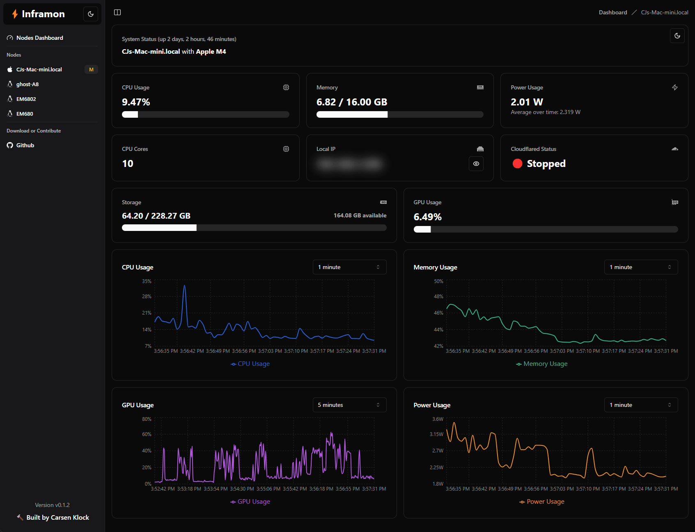

# ⚡Inframon


Inframon Server Monitor is a lightweight, real-time local networked monitoring application that provides a sleek local networked dashboard for tracking various system metrics through a local web interface. Auto Master Node Local Network Discovery is supported (multiple devices supported). Written by Carsen Klock

#### This is currently intended only to be used with Apple Silicon Macs (any M-series chip) OR Linux AMD machines with ROCm GPU drivers installed.

#### TODO: Linux NVIDIA Support

## Install Script

See [install.sh](install.sh) for a simple install script that handles all the manual steps below.

```
curl -fsSL https://raw.githubusercontent.com/metaspartan/inframon/refs/heads/main/install.sh | sudo bash
```

(Setup your master node first ("Y" on first prompt), then run the install script again on other local machines to add additional nodes by selecting "N" when prompted, your master node will automatically be discovered by other nodes on your local network, ensure the install.sh is ran with sudo from a user with sudo access).





## Features

- Real-time monitoring of CPU usage, memory usage, and power wattage consumption
- System information display (hostname, CPU model, uptime)
- Storage usage visualization
- Historical data charts for CPU, memory, and power usage
- Light and dark mode theme support (Built with Shadcn/UI)
- Local IP address display (with toggle to show/hide)
- Cloudflared status indicator
- GPU usage monitoring for Apple Silicon Macs
- Local Networked Node list with power usage, cpu usage, memory usage, and more
- Master and Node modes (One master, for multiple nodes)
- Install script for easy setup
- Auto Master Node Local Network Discovery

## Supported Platforms and Devices

- MacOS (Apple Silicon)
- Linux (x86_64) AMD Ryzen Only (Requires ROCm GPU drivers installed)

## Requirements
- Bun (https://bun.sh)
- Local Network Access (Master and Nodes)

## Install Script

See [install.sh](install.sh) for a simple install script that handles all the manual steps below.

```
curl -fsSL https://raw.githubusercontent.com/metaspartan/inframon/refs/heads/main/install.sh | sudo bash
```

(Setup your master node first, then run the install script again on other local machines to add additional nodes by selecting "N" when prompted, your master node will automatically be discovered by other nodes on your local network)

## Install Bun for Manual Installation

```
curl -fsSL https://bun.sh/install | bash
```

## Manual Installation

1. Clone the repository:
   ```
   git clone https://github.com/metaspartan/inframon.git
   cd inframon
   ```

2. Install dependencies:
   ```
   bun install
   ```

3. Build the application:
   ```
   bun run build
   ```

4. Setup the master server:

```
sudo IS_MASTER=true bun run inframon.ts
```

For running multiple machines on a local network:
(Repeat steps 1-3 for each node server, replacing `192.168.1.250` with your master server's local IP address, and master runs on port 3899, there is no need to manually set the master URL on each node as auto discovery is supported on port 3898)

4. Setup the node server (replace `192.168.1.250` with your master server's local IP address), master runs on port 3899:

```
sudo IS_MASTER=false MASTER_URL=http://192.168.1.250:3899 bun run inframon.ts
```

5. Optional: Set up the systemd service (if AMD Linux):
   Create a new file named `inframon.service` in `/etc/systemd/system/` with the following content (edited to your needs):

   ```
   [Unit]
   Description=Server Monitor
   After=network.target

   [Service]
   Environment=IS_MASTER=false
   Environment=MASTER_URL=http://<your_master_server_ip>:3899
   ExecStart=/usr/bin/node /path/to/inframon/inframon.ts
   Restart=always
   User=your_username
   Environment=NODE_ENV=production

   [Install]
   WantedBy=multi-user.target
   ```

   Replace `/path/to/inframon` with the actual path to your Inframon installation directory and `your_username` with the appropriate system username. Also replace `<your_master_server_ip>` with the actual local network IP address of your master server if running multiple machines on a local network. If you are running the master server, set `IS_MASTER=true` and remove the `MASTER_URL` environment variable.

6. Enable and start the service:
   ```
   sudo systemctl enable inframon.service
   sudo systemctl start inframon.service
   ```

7. Open a web browser on your local network and navigate to your master server's local IP address:

```
http://192.168.1.250:3869
```

## Usage

Once a master server Inframon service is running, you can access the ⚡Inframon dashboard by opening a web browser and navigating to:

```
http://192.168.1.250:3869
```

Replace `192.168.1.250` with the actual local network IP address of your master server.

## Configuration

You can create a new `.env` file to configure the master and node servers. See [.env.example](.env.example) for more information. (Note: The install script will handle creating the `.env` file for you)
