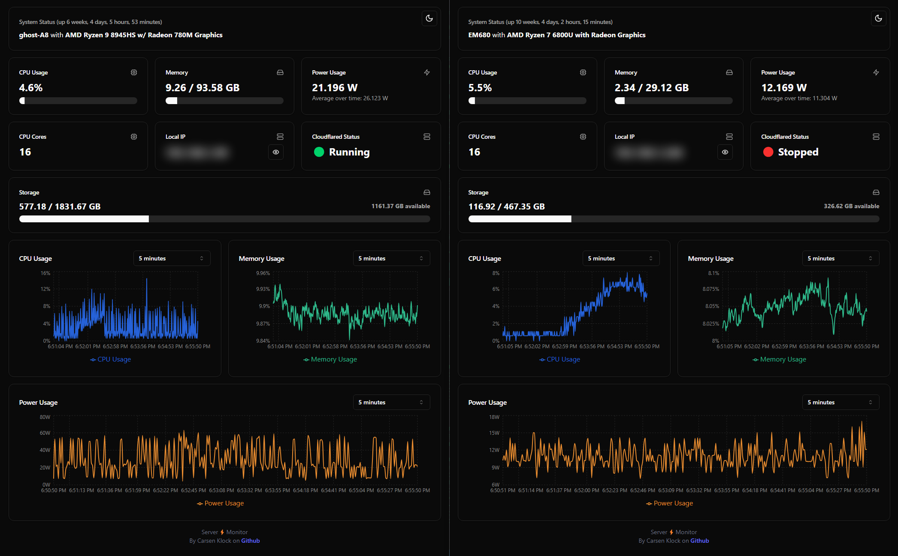

# Server⚡Monitor

Server⚡Monitor is a lightweight, real-time server monitoring application that provides a sleek local dashboard for tracking various system metrics, particularly useful for local server nodes that run `cloudflared` tunnels. Written by Carsen Klock (@metaspartan)



## Features

- Real-time monitoring of CPU usage, memory usage, and power consumption
- System information display (hostname, CPU model, uptime)
- Storage usage visualization
- Historical data charts for CPU, memory, and power usage
- Light and dark mode theme support (Built with Shadcn/UI)
- Local IP address display (with toggle to show/hide)
- Cloudflared status indicator
- GPU usage monitoring for Apple Silicon Macs

## Supported Platforms and Devices

- MacOS (Apple Silicon)
- Linux (x86_64) AMD Ryzen Only (Requires ROCm GPU drivers installed)

## Installation

1. Clone the repository:
   ```
   git clone https://github.com/metaspartan/servermon.git
   cd servermon
   ```

2. Install dependencies:
   ```
   bun install
   ```

3. Build the application:
   ```
   bun run build
   ```

4. Set up the systemd service:
   Create a new file named `servermon.service` in `/etc/systemd/system/` with the following content:

   ```
   [Unit]
   Description=Server Monitor
   After=network.target

   [Service]
   ExecStart=/usr/bin/node /path/to/servermon/servermon.js
   Restart=always
   User=your_username
   Environment=NODE_ENV=production

   [Install]
   WantedBy=multi-user.target
   ```

   Replace `/path/to/servermon` with the actual path to your Server⚡Monitor installation directory and `your_username` with the appropriate system username.

5. Enable and start the service:
   ```
   sudo systemctl enable servermon.service
   sudo systemctl start servermon.service
   ```

## Usage

Once the service is running, you can access the Server⚡Monitor dashboard by opening a web browser and navigating to:

```
http://your_server_ip:3869
```

Replace `your_server_ip` with the actual local network IP address of your server.

## Configuration

Edit `lib/api.ts` to change the server's local IP address if having issues and run `bun run build` again.
